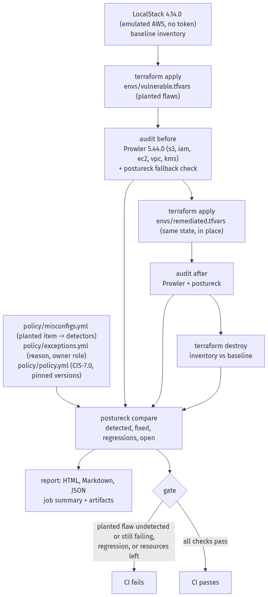

# Lab 12 — AWS cloud security posture audit (emulated)

A fictional small company ("acme") set up its AWS account by hand and never reviewed it. This lab rebuilds that
account with Terraform, plants documented misconfigurations, audits it with **Prowler**, fixes the flaws as code,
audits again and tears everything down — and CI fails unless every planted flaw was detected before the fix, cleared
after it, nothing new appeared and nothing was left behind.

**The AWS account is emulated (LocalStack); no real AWS account is used.** Every result comes from GitHub Actions runs.

**Status: completed.** Every result below comes from GitHub Actions runs against the emulator.

## Results

From [run 37812253346](https://github.com/santorest/lab-12-aws-posture/actions/runs/37812253346), the final code (LocalStack 4.14.0, Prowler 5.44.0, CIS AWS Foundations v7.0);
[`docs/example-report.html`](docs/example-report.html) is its report.

| | Before the fix | After the fix |
|---|---|---|
| Planted items detected | **6 / 6** | — |
| Planted items passing | 0 / 6 | **6 / 6** |
| Regressions | — | **0** |
| Resources left after teardown | — | **0** |

The open findings (failing before and after) are dominated by the emulator's own sample data — 1,159 of 1,201 are
unencrypted sample EBS snapshots; 20 are on the lab's resources. Details, the demo pull requests and how the first
run failed are in [WRITEUP.md](WRITEUP.md#7-results).

## How the cycle works



1. **Emulator.** LocalStack `4.14.0` (community edition), pinned by digest: the last release that starts without an
   auth token. A baseline inventory records what the emulator holds before anything is created (it ships sample
   resources).
2. **Vulnerable posture.** `terraform apply -var-file=envs/vulnerable.tfvars` builds the account with the planted
   flaws switched on.
3. **Audit before.** Prowler 5.44.0 scans S3, IAM, EC2, VPC and KMS (unused resources included: the emulated account
   has no workloads). One planted flaw Prowler has no check for is covered by a small fallback check in `postureck`;
   every finding names the tool that produced it.
4. **Remediation.** `terraform apply -var-file=envs/remediated.tfvars` on the same state: the fix is an in-place
   change of the same resources, the way a real fix lands.
5. **Audit after**, the same way.
6. **Teardown.** `terraform destroy`, then the inventory must match the baseline.
7. **Report and gate.** `postureck` merges both tools' findings by (check, resource), compares the audits and writes
   `out/report.html`, `out/summary.md` and `out/results.json`.

## Planted misconfigurations

From [`policy/misconfigs.yml`](policy/misconfigs.yml); CIS ids are those Prowler 5.44.0 maps to CIS AWS Foundations
v7.0.

| Item | Misconfiguration | CIS | Detected by |
|---|---|---|---|
| 1 | Assets bucket publicly readable, Block Public Access off | 3.1.4 | Prowler |
| 2a | Customer data not encrypted with the company's KMS key (S3 encrypts with SSE-S3 by default) | outside CIS 7.0 | Prowler |
| 2b | Customer data bucket unversioned and reachable over HTTP | 3.1.1 | Prowler |
| 3 | Policy allowing every action on every resource, attached to a user | 2.14 | Prowler |
| 4a | Long-lived access key on a user without MFA | 2.10 | postureck (Prowler checks MFA only for console users) |
| 4b | Weak account password policy | 2.8, 2.9 | Prowler |
| 6a | SSH and RDP open to the internet | 6.3 | Prowler |
| 6b | Default security group allows traffic | 6.5 | Prowler |
| 7a | KMS key without rotation | 4.6 | Prowler |
| 7b | VPC without flow logs | 4.7 | Prowler |

Item 5 of the plan (no CloudTrail) is **not planted**: the tokenless LocalStack has no CloudTrail service.
Exceptions live in [`policy/exceptions.yml`](policy/exceptions.yml), each with a reason and an owner role; there are
none.

## Gate

CI fails (exit 1) when a planted flaw was **not detected** before the fix, a planted flaw **still fails** after it
(or its detector went silent), a finding that was not failing before **fails after** (a regression, even when the
totals fell), or **resources are left** after teardown. An audit that did not happen — LocalStack unhealthy, a
Terraform step failed, Prowler wrote no output, or a deployed service has no finding from any tool — is an error
(exit 2), never a clean result.

## Quick start (Linux, macOS or WSL with Docker, Terraform and Python 3.12)

```bash
python -m venv .venv && . .venv/bin/activate
pip install -r requirements-dev.txt && pip install --no-deps -e .
bash scripts/run-audit.sh          # starts LocalStack, installs Prowler into .venv-prowler, runs the cycle
# then open out/report.html (figures: out/results.json)
```

`docker rm -f localstack` stops the emulator.

## CI and tests

| Job | What it proves |
|---|---|
| `lint` | terraform fmt and validate, tflint (AWS ruleset), ruff, mypy (strict), shellcheck, yamllint |
| `unit` | `postureck` on fixtures from real Prowler output and on moto: audits that did not happen, undetected and silent detectors, matching by Name tag, regressions, exceptions, escaping; `terraform test` with a mocked provider (each flaw present in the vulnerable posture, absent in the remediated one); coverage gate 90 % |
| `iac-scan` | Checkov on both postures, reported for comparison; it does not gate |
| `audit` | the whole cycle on LocalStack; artifacts: Prowler output, fallback findings, Terraform logs, inventories, report |
| `secrets` | gitleaks over the full history |

The audit also runs weekly and on demand.

## Limits

- The target is **emulated AWS (LocalStack 4.14.0 community)**, not a real account. Results show that the method
  works, not the posture of any real account.
- Prowler's coverage on the emulator is partial; the report names the tool behind each finding.
- Not testable here: CloudTrail (not in the emulator), root-account controls, GuardDuty, Security Hub, Organizations.
- The emulator ships sample resources (for example EC2 snapshots); their findings fail before and after and appear as
  "open", which inflates the totals. The planted items, regressions and teardown are what the gate judges.

## License

MIT — see [LICENSE](LICENSE).
